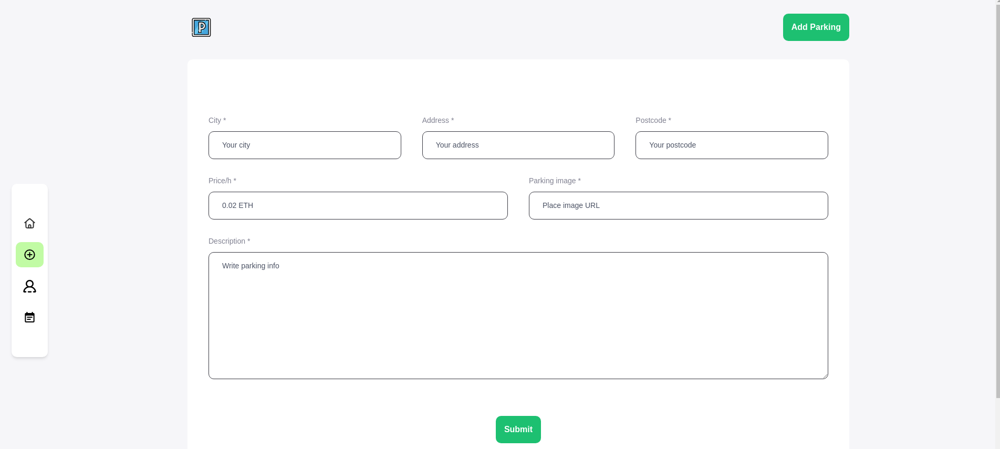
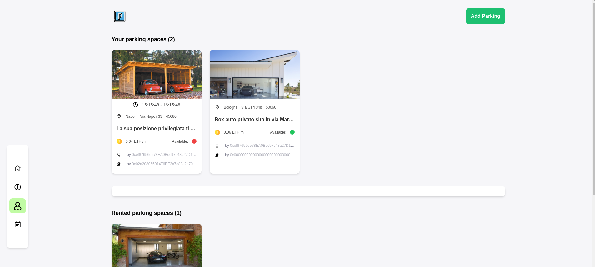
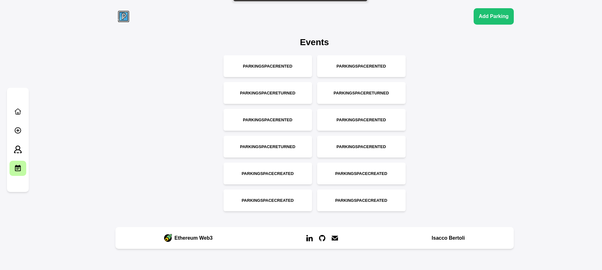
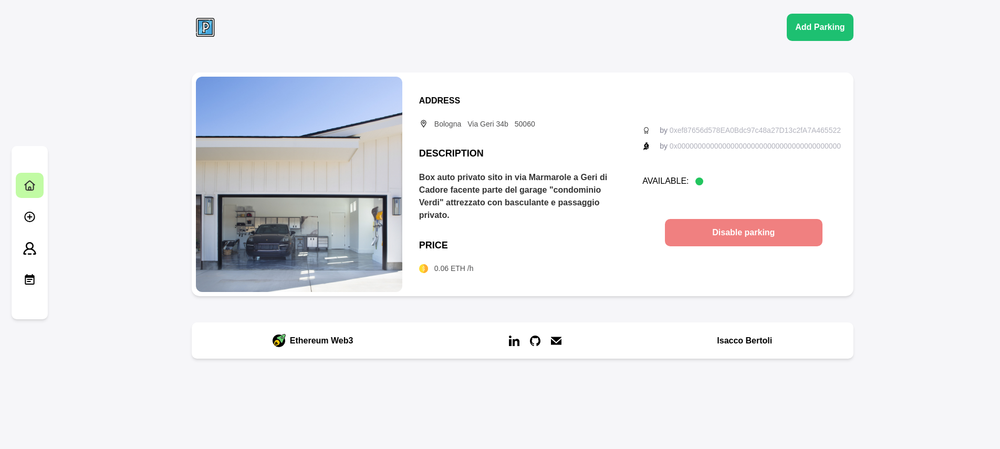
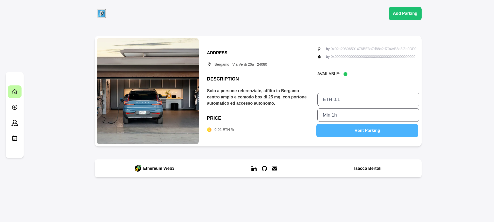
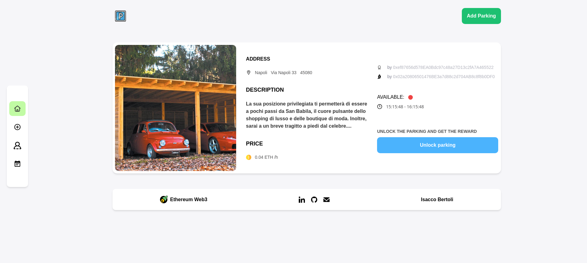

# Parking-web3
- Parking Web3 is an online platform for booking or renting parking spaces. It interacts with a custom smart contract, ensuring secure transactions through the use of blockchain technology.
<a href="https://demo3.isaccobertoli.com/">Try Demo</a>

## Requirements:

 
- On the homepage, it is possible to log in through MetaMask and view all available parking spaces.

    

- Once logged in, it is possible to add a parking space for rent.

    

- In the profile section, you can see your own parking spaces and the ones you have rented.

    

- In the events section, you can see the complete list of events generated by the smart contract.

    

- Once a parking space is created, you can choose to disable it if you no longer want to rent it out.

    

- You can rent a parking space by deciding the price and hours.

    

- Once the rental time has expired, the owner of the parking space can unlock it to collect the earnings and put it up for rent again.

    

## Deployment

To deploy this project:
- Clone the GitHub repo.
- Create a .env file in both the client and web3 folders and insert all the necessary API keys. You can take an example from the .env.example file.
- Open a terminal in the client folder and type the following command:
- npm install
- npm run dev

## Skills
React, Javascript, Web3, Solidity, HTML, CSS

## 🔗 Links

 
<a href="https://demo3.isaccobertoli.com/">Try Demo</a>
